**项目简介：**  
本项目基于主流的前后端分离架构，采用 **SpringBoot + Vue 技术栈**，配套 **MySQL 数据库**，适用于毕业设计与课题实训开发。  
本人已整理了超 **4000 多套毕业设计源码+论文+开题报告+PPT...**，涵盖 **Java、SpringBoot、Vue、SSM、uni-app 小程序、PHP、Android** 等方向，支持功能修改定制与论文服务。  
**团队提供以下服务：**  
- 项目代码修改与调试  
- 数据库配置与远程协助  
- 论文定制与修改  
**获取更多的4000多套源码或SQL文件请联系：**  
- QQ：3906443360 微信：BesheHelp

# springboot020基于Java的免税商品优选购物商城设计与实现代码

5.1登录界面

登录窗口，用户通过登录窗口可以进行登录,进行输入用户名、密码等信息，进行登录操作，如图5-1所示。

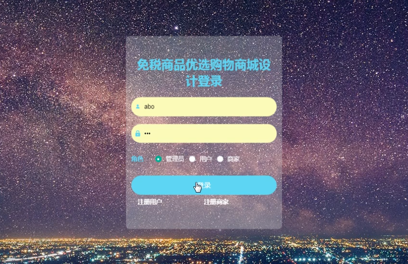

图5-1登录界面

5.2管理员功能模块

管理员登录成功后，可以进行查看个人中心、用户管理、商家管理、商品分类管理、商品信息管理、在线客服管理、系统管理、订单管理等功能模块。进行相对应操作。

用户管理：通过列表可以获取账号、用户名、姓名、性别、头像、联系电话、照片、地址等信息，进行查看详情、修改或删除操作，如图5-2所示。

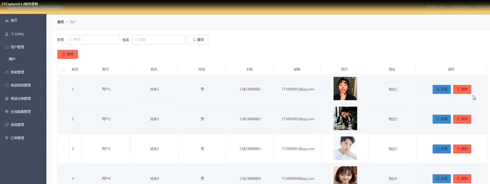

图5-2用户管理界面

商家管理：通过列表可以获取商家的详细信息内容，进行查看详情或删除操作，如图5-3所示。

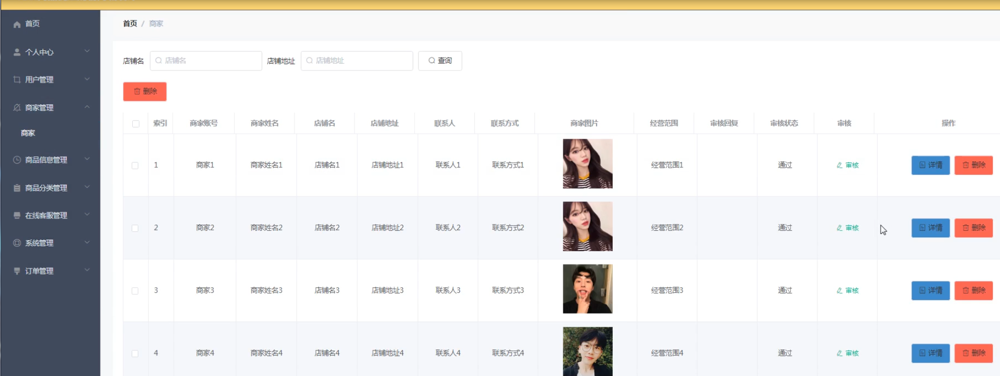

图5-3商家管理界面

订单管理：通过列表可以获取订单编号、商品名称、商品图片、购买数量、价格、总价格、支付类型、状态、地址等信息，进行查看详情或发货、删除操作，如图5-4所示。

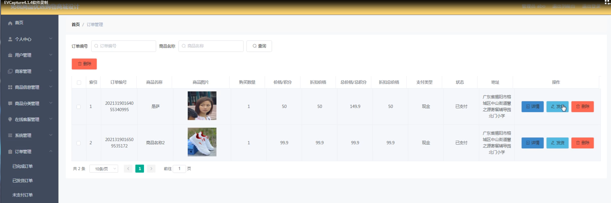

图5-4订单管理界面图

5.3商家功能模块

商家通过点击后台管理进入后台系统可以进行查看个人中心、商品信息管理、商品分类管理、在线客服管理、订单管理等功能模块，进行相对应操作，通过点击个人信息页面可以进行查看员工的基本信息，进行查看或修改操作，如图5-5所示。

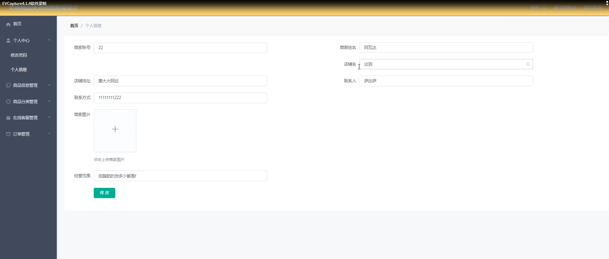

图5-5商家信息界面

商品信息管理：通过列表可以获取商品名称、商品类型、规格、图片、商家账号、商家姓名、价格等信息内容，进行查看详情、在线客服、查看评论、新增或删除操作，如图5-6所示。

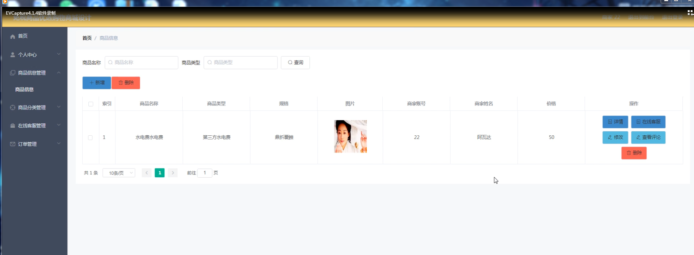

图5-6商品信息管理界面

在线客服管理：通过列表可以获取客服编号、内容、账号、姓名、商家账号、商家姓名、客服回复等信息，进行查看详情、修改、删除操作，如图5-7所示。

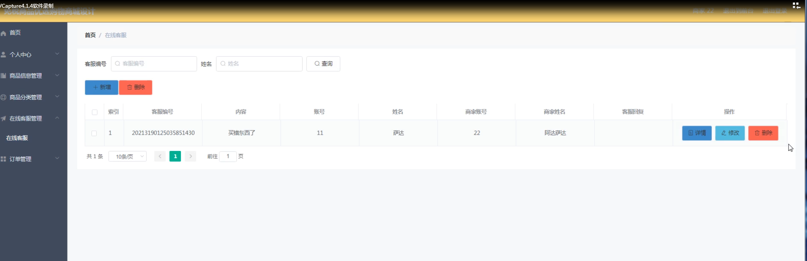

图5-7在线客服管理界面

我的收藏管理：通过列表可以获取收藏名称、收藏图片等信息，进行查看详情、修改或删除操作，如图5-8所示。

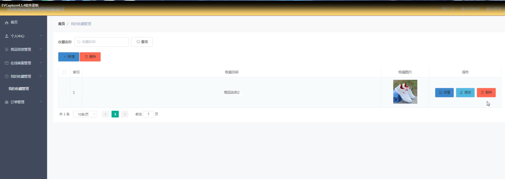

图5-8我的收藏管理界面

订单管理：通过列表可以获取订单编号、商品名称、商品图片、购买数量、价格、总价格、支付类型、状态、地址等信息，进行查看详情或删除操作，如图5-9所示。

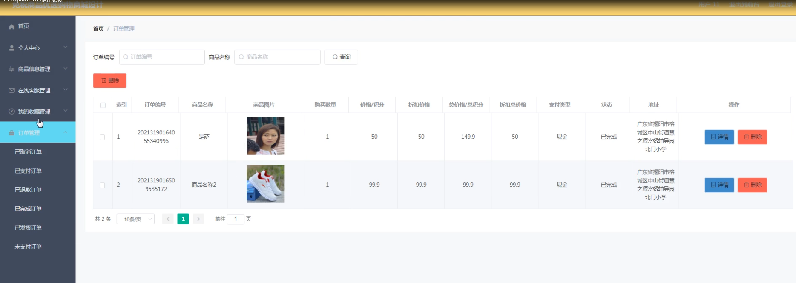

图5-9订单管理界面

5.2用户前台功能模块

用户通过家免税商品优选购物商城系统，可以进行查看首页、商品信息、商城快讯、个人中心、后台管理、购物车等功能，可以进行相对应的操作，如图5-10所示。

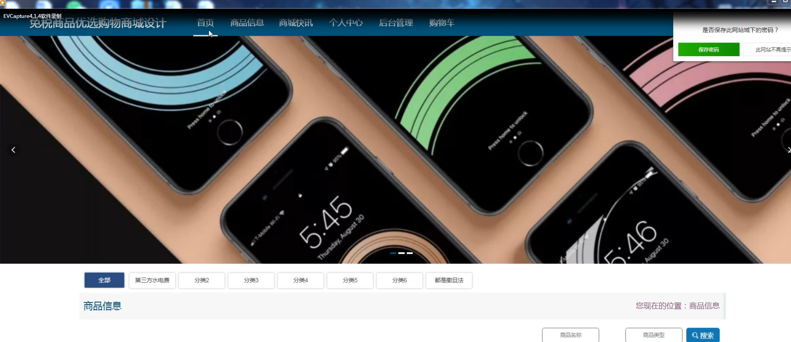

图5-10首页系统界面

商品信息详情：通过页面可以进行查看商品名称、商品价格、商品类型、规格、商家账号、商家账号、商家姓名、点击次数等信息，进行添加到购物车或立即购买、点我收藏，如图5-11所示。

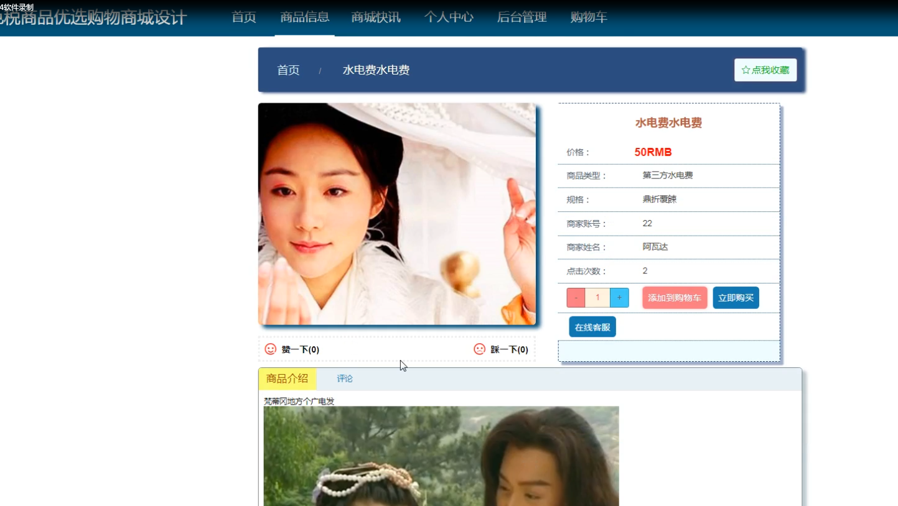

图5-11商品信息界面

个人中心：通过页面可以进行查看获取个人中心、我的订单、我的地址、我的收藏四个子模块，个人中心：通过页面可以进行查看个人信息或进行更新个人信息，进行提交保存操作，如图5-12所示。我的订单：通过列表可以获取订单编号、商品、价格、数量、总价、地址等信息，进行查看我的订单或进行退款操作，如图5-13所示。我的地址：通过页面可以进行查看联系人、手机号码、选择地址等信息，进行查看或修改、删除操作，并通过输入添加新地址进行添加操作，如图5-14所示。

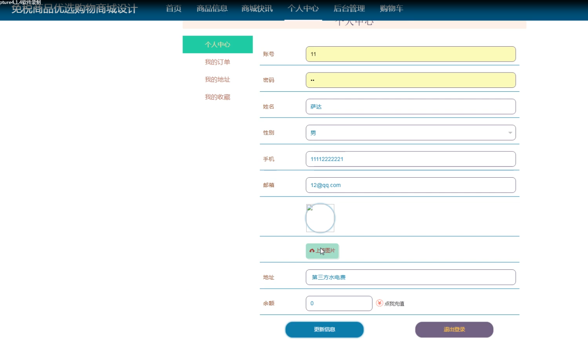

图5-12个人信息界面

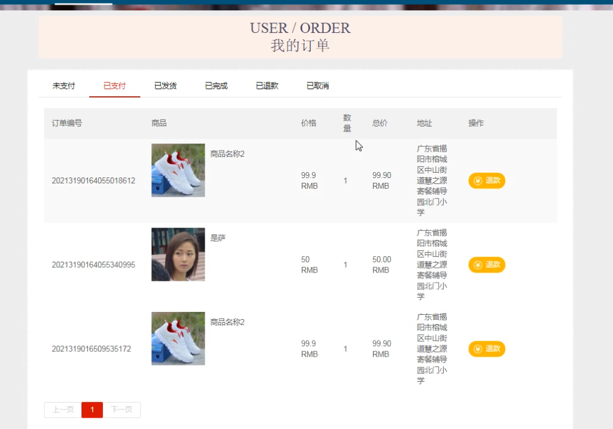

图5-13我的订单界面

图5-14我的地址界面图

5.3用户后台功能模块

用户通过点击后台管理进入后台系统可以进行查看个人中心、商品信息管理、在线客服管理、我的收藏管理、订单管理等功能模块，进行相对应操作，如图5-15所示。

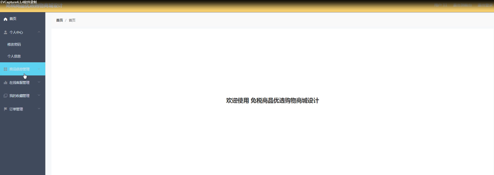

图5-15用户后台系统界面

在线客服管理：通过列表可以获取客服编号、内容、账号、姓名、商家账号、商家姓名、客服回复等信息，进行查看详情操作，如图5-16所示。

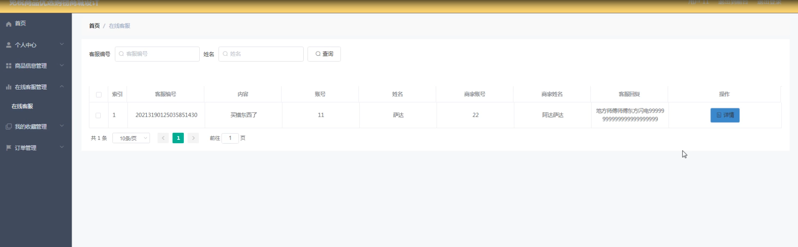

图5-16在线客服管理界面

商品信息管理：通过列表可以获取商品名称、商品类型、规格、图片、商家账号、商家姓名、价格等信息内容，进行查看详情、在线客服、查看评论、新增或删除操作，如图5-17所示。

图5-17商品信息管理界面